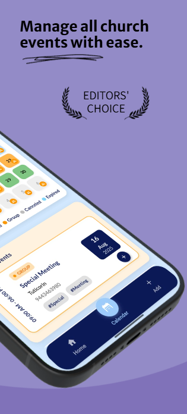

<!-- Header with logo + name inline -->
<p align="center">
  
  <span style="font-size: 2.4em; font-weight: bold; vertical-align: middle; margin-left: 12px;">HLM 04 Events App</span>
</p>

<p align="center">
  <em>Plan, manage, and track church events with notes — fast, modern, and built with Flutter.</em>
</p>

<p align="center">
  <!-- Badges -->
  <a href="https://flutter.dev/"></a>
  <a href="https://dart.dev/"></a>
  
  
  
</p>

---

## ✨ Highlights

- 📅 **View Scheduled Events** – Calendar & list views to see what’s coming up at a glance  
- ➕ **Add Events** – Create events with title, date/time, location, and tags  
- ✏️ **Edit & Delete** – Update details anytime or remove canceled events  
- 📝 **Add Notes per Event** – Attach prayer points, agendas, and follow-ups to each event  
- 🔔 **(Optional) Reminders** – Notify the pastor/team before an event  
- 🔎 **Search & Filters** – Find events by name, date, or tag quickly  
- ⚡ **Smooth & Fast** – Optimized for quick navigation and offline-friendly storage *(configurable)*

---

## 📸 Screenshots

<p align="center">
  
  
  
  
</p>

---

## 🛠 Tech Stack

- **Framework:** Flutter  
- **Language:** Dart  
- **State Management:** Provider / Riverpod *(update to what you use)*  
- **Storage:** SharedPreferences / Hive / SQLite *(update to actual)*  
- **Notifications:** flutter_local_notifications *(optional, if enabled)*

---

## 🚀 Quick Start

```bash
# Clone your repo
git clone <your-repo-url>
cd <your-project-folder>

# Install dependencies
flutter pub get

# Run
flutter run
